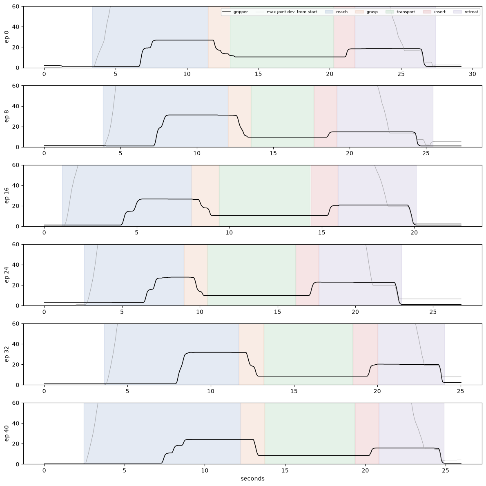
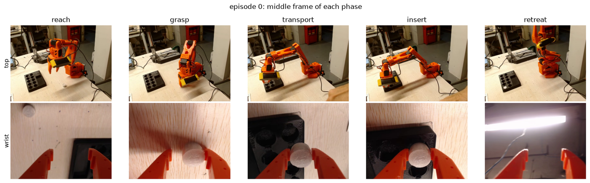
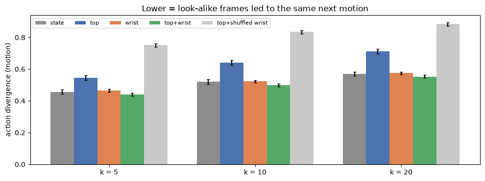
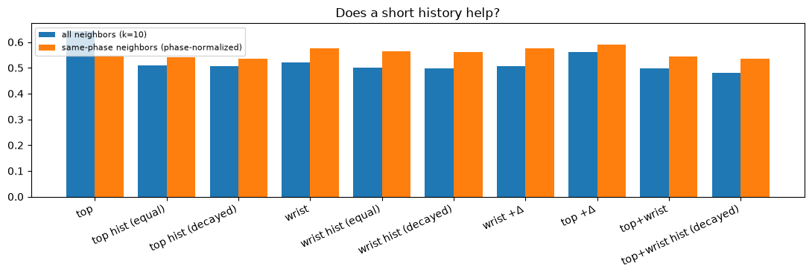
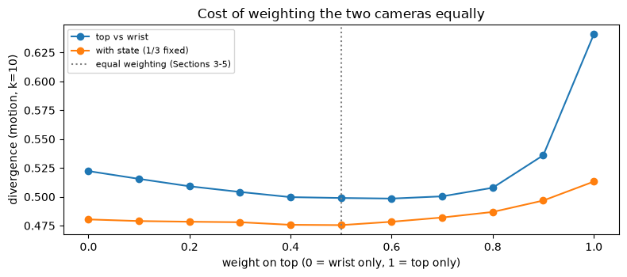
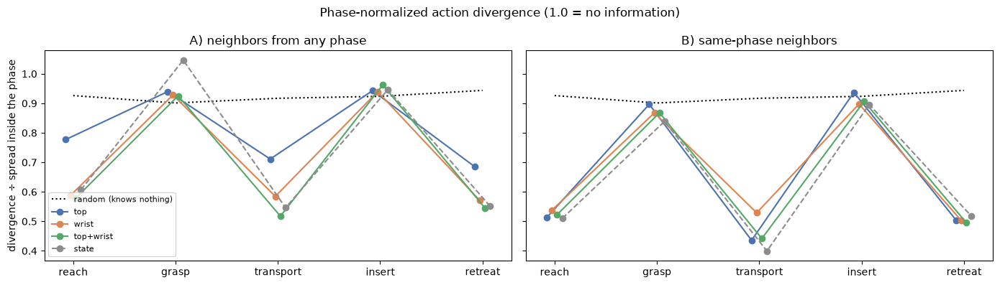
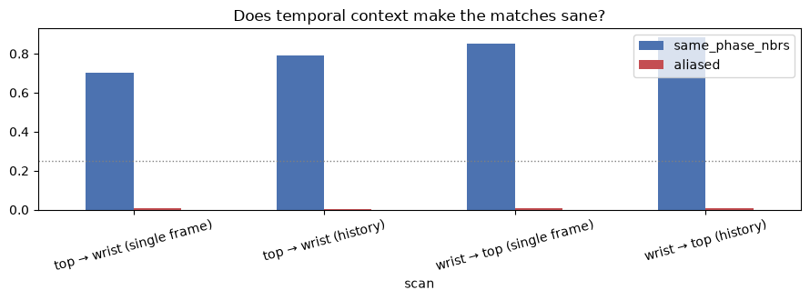
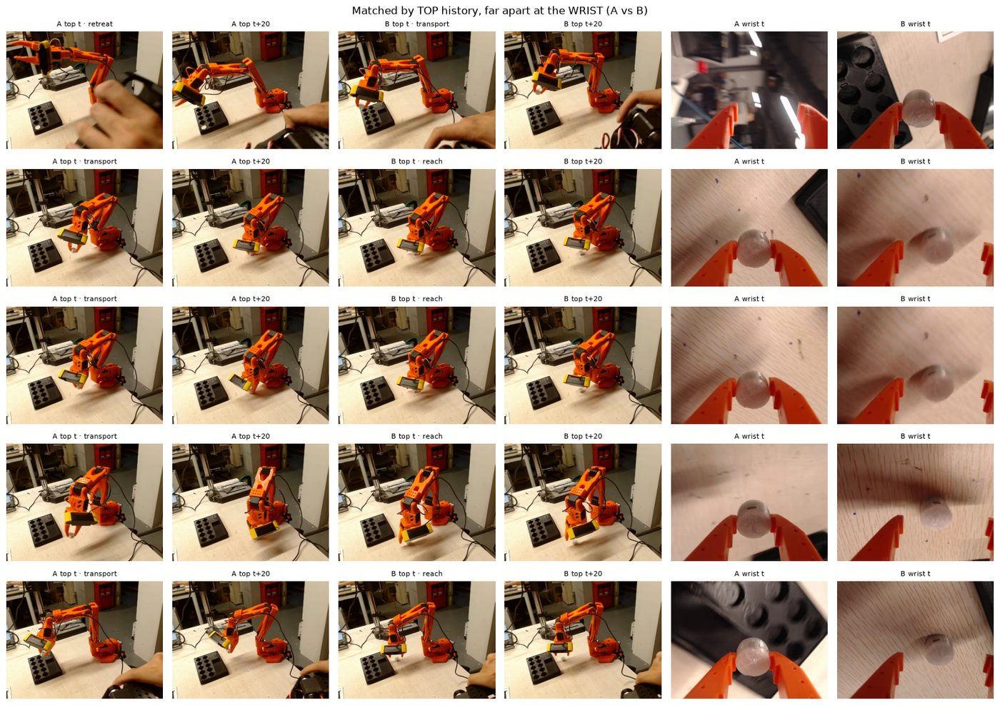
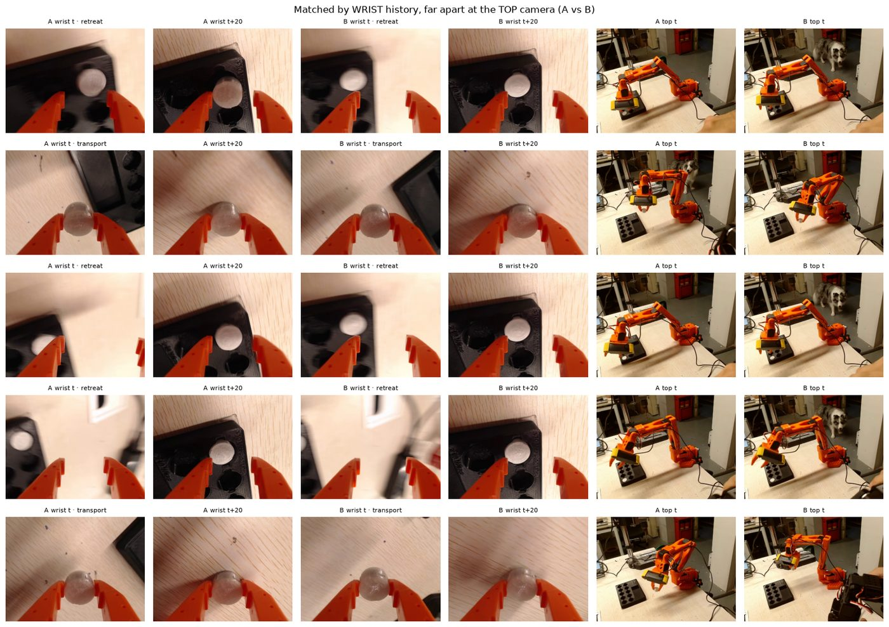
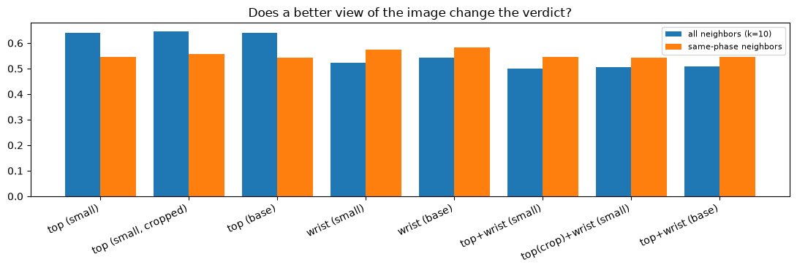

# Phase 0.5 — second-camera test (C1): findings

Dataset `HALDijkstraaa/so101_toolkit_cylinder_20260917_165544` (50 clean episodes, both cameras, 4000
sampled frames). Notebook: [phase05_second_camera.ipynb](../phase05_second_camera.ipynb) · Plan:
[08 §A.4](../08_data_quality_research.md) · Task: [toolkit_task_card.md](toolkit_task_card.md).
Baseline run 2026-09-19, follow-ups 2026-09-20.

---

# Summary

**The problem.** Is one camera enough for this task, and how would we know *before* spending GPU-hours on
training? The proxy: **action divergence** — take a frame, find the k frames from *other* episodes that look
most similar, and measure how differently the demonstrator moved next. Low = the observation determines the
action. High = the policy has to guess.

*Every episode is trimmed to its moving part and split into five phases from the gripper trace: reach,
grasp (1 s before to 0.5 s after closing), transport, insert (same window around release), retreat.*

*The two views at the middle of each phase. Top (front-side, wide) vs wrist (eye-in-hand).*

**What we hypothesized** (08 §A.4) and **what happened**:

| | Hypothesis | Verdict |
|---|---|---|
| **H-c** | top+wrist lowers divergence vs top alone, beyond a shuffled control | **Confirmed** at every k, bootstrap CI clear of 0 |
| **H-a** | wrist wins in grasp/insert | **Confirmed**, but only after normalizing *within* phase |
| **H-b** | top wins in reach | **Confirmed** (and strongest in transport), same caveat |
| **H-f** | wrist frames are more varied | **Confirmed** (0.468 vs 0.186), descriptive only |
| **H-e** | joint state is most ambiguous at the start | **Refuted** — state is the *strongest* single space |
| **H-d** | aliased pairs concentrate in grasp/insert | **Refuted as stated** — single-frame "aliasing" was mostly phase confusion; with temporal context it nearly vanishes |

**Main results, in order of importance:**

- **Both cameras are worth keeping, but they are largely redundant.** top+wrist 0.499 vs wrist alone 0.522
  (k=10). Not a weighting artifact: sweeping the top/wrist weight is flat (best 0.498 at 0.6 vs 0.499 at
  equal), so **keep the equal 50/50 concatenation**.
- **Each camera wins where its geometry says it should** — once divergence is normalized within each phase:
  top in reach and transport, wrist in grasp and insert.
- **A short frame history is the single biggest gain**, bigger than adding the second camera: top alone
  improves 0.641 → 0.508, and top+wrist+history is the best space at 0.479.
- **In grasp and insert, no observation beats chance.** Every space sits near the random baseline there.
- **Neither a bigger encoder (`dinov2-base`) nor cropping the top view changes anything** — the top camera's
  weakness was missing temporal context, not resolution or background clutter.

*Baseline run: joint state is the strongest single space; top+wrist is best overall; the shuffled-wrist
control (grey) is far worse, which is what makes the comparison meaningful.*

*The clean phase result (same-phase neighbors, phase-normalized): top is better by 0.025 in reach and 0.093
in transport; wrist by 0.029 in grasp and 0.039 in insert.*

*History (t, t−10, t−20 in separate blocks) helps every space, and helps the weak top camera most. The blue
and orange bars use different normalizations — compare within a colour only.*

**Guidelines that follow** (details in [Guidelines](#guidelines-for-collection-and-analysis)): spend the
extra episodes and the discipline on grasp and insert; use temporal embeddings for any future divergence
measurement; keep equal weighting; always report a control and a random baseline; keep the background clean
when a batch is meant for measurement.

---

# The metric, precisely

For each sampled frame, in each observation space:

1. distance to every other sampled frame — cosine for image embeddings (DINOv2, L2-normalized), Euclidean
   for z-scored joints;
2. **neighbors from the same episode are excluded** (they are the same moment a few hundredths of a second
   apart and would trivially agree);
3. take the k nearest, k ∈ {5, 10, 20};
4. **divergence** = √(mean over joints of the variance of their *next motion*) ÷ the same quantity over all
   frames. Next motion = commanded pose 10 frames (⅓ s) ahead minus the current pose;
5. uncertainty by bootstrap over **episodes**, not frames.

Two normalizations appear, and they are **not comparable with each other**:

- **global** (Sections 3–5): divided by the spread over the whole dataset;
- **within-phase** (Sections 9+): divided by the spread inside that phase, so 1.0 always means "no
  information". The random baseline lands at ≈0.90–0.94, and *that*, not 1.0, is the zero line.

---

# Results in detail

## 1. Both cameras, and the control (baseline run)

| Space | k=5 | k=10 | k=20 |
|---|---|---|---|
| joint state | 0.457 | 0.520 | 0.569 |
| top | 0.544 | 0.641 | 0.711 |
| wrist | 0.464 | 0.522 | 0.576 |
| **top+wrist** | **0.440** | **0.499** | **0.553** |
| top + shuffled wrist (control) | 0.750 | 0.834 | 0.884 |

Gain of top+wrist over top: 0.142 at k=10, CI [0.127, 0.156] — H-c passes at every k. The gain over *wrist*
is only 0.023, because the two views overlap: once the arm is aimed at the cylinder, the wrist image implies
much of what the top view shows.

*The equal-weighting suspicion was wrong: the curve is flat between 0.3 and 0.7. Redundancy, not weighting.*

## 2. Phase structure (the corrected view)

| Space (same-phase neighbors, k=10) | reach | grasp | transport | insert | retreat |
|---|---|---|---|---|---|
| top | **0.514** | 0.897 | **0.436** | 0.937 | 0.504 |
| wrist | 0.538 | **0.868** | 0.529 | **0.898** | 0.503 |
| top+wrist | 0.523 | 0.868 | 0.442 | 0.907 | 0.495 |
| state | 0.510 | 0.839 | 0.399 | 0.896 | 0.517 |
| random baseline | 0.926 | 0.901 | 0.917 | 0.924 | 0.944 |

The first run's phase table (global normalization) said the opposite, because in grasp and insert the arm
barely moves: the local spread is small for *every* space, so all curves drop together. That was arithmetic,
not information.

**In grasp and insert, everything is near the random baseline.** Given everything the robot can observe, the
demonstrations at those instants move in **different directions across episodes**. Three causes, not
separable with this data: (1) genuine multi-modality — several acceptable ways to close the last
millimetres; (2) small corrections and jitter dominating when the motion is small; (3) the observation truly
lacking mm-level detail.

## 3. Joint state is the strongest single space

Partly real, partly measurement:

- **Real:** one operator, a stereotyped task. The pose says where the task is and what comes next, and the
  target is the same joint signal ⅓ s later. The cameras have to infer what the joints state directly.
- **Artifact:** 6-D Euclidean vs 384-D cosine. In 6-D the 10 nearest neighbors really are nearly the same
  pose; in 384-D distances concentrate and "nearest" is relatively far. Ranking spaces of very different
  dimension is therefore not strictly fair. (Forcing the state block to unit length for the Section 10
  blends also costs a little: 0.520 → 0.538.)
- The formula is identical everywhere — same k, same target, same normalization — so this is geometry, not a
  different metric.

**Cameras still add over proprioception:** state 0.538 → state+wrist 0.480 → state+top+wrist 0.475 (k=10).

## 4. Temporal context

| Space | k=10 |
|---|---|
| top | 0.641 |
| top + history (decayed) | 0.508 |
| wrist | 0.522 |
| wrist + history (decayed) | 0.497 |
| top+wrist | 0.499 |
| **top+wrist + history (decayed)** | **0.479** |
| top +Δ / wrist +Δ | 0.562 / 0.507 |

History = embeddings at t, t−10, t−20, each in **its own block of dimensions** — that block layout is the
positional encoding, so "now" and "0.67 s ago" can never be confused. Real lagged frames clearly beat a
difference vector (`+Δ`): use lagged embeddings, not deltas.

## 5. Aliasing, before and after temporal context

| Scan (neighbors from any phase, k=10) | same-phase neighbors | aliased |
|---|---|---|
| top → wrist, single frame | 0.701 | 0.007 |
| top → wrist, history | **0.792** | 0.001 |
| wrist → top, single frame | 0.850 | 0.009 |
| wrist → top, history | **0.885** | 0.006 |

Chance level for "aliased" is ~25% (two median splits), so even the single-frame rate was far below chance.
With history, matched pairs come from the same phase far more often and the aliased share nearly vanishes:
**most of what looked like aliasing was the single frame confusing one stage of the task with another.**

*Matched by top history, far apart at the wrist. The top camera still cannot separate reach from transport —
the arm occludes the cylinder — while the wrist view shows instantly whether something is between the
fingers. This is the clearest picture of what the second camera buys.*

*Matched by wrist history, far apart at the top camera. The wrist view is close to a phase detector (partly
circular: phases were defined from the gripper signal). The "difference" the top camera sees is often
background — **a dog walking past**, a hand at the frame edge, changing light.*

**The background artifact cuts both ways:**

- *For metrics, it is noise.* Top-camera visual diversity partly measures the room, so H-f is softer than it
  looks, and background motion can push genuinely similar frames apart.
- *For training, it is probably mild augmentation.* The distractors are uncorrelated with cylinder position
  and with phase, so a policy has no incentive to key on them, and they supply the nuisance variation that
  domain randomization tries to manufacture. It would only hurt if a distractor correlated with the task —
  someone reaching in at the same moment every episode.

## 6. Representation probe: a clean null result

`dinov2-base` (top 0.639 vs 0.641) and a cropped top view (0.647) change nothing, and diversity barely
moves. The weakness was temporal, not visual.

---

# Guidelines for collection and analysis

**What action divergence is good for** — the list verified against these runs, with extensions:

| Use | Supported by | How to run it |
|---|---|---|
| **Is a camera pointed usefully?** | top 0.641 vs wrist 0.522; per-phase table | Record ~5 episodes, embed, compare per-phase divergence between candidate placements before committing the rig |
| **Are two cameras complementary or redundant?** | top+wrist 0.499 vs wrist 0.522, flat weight sweep | Compare the pair against each single view *and* against a shuffled control |
| **Which phase needs more or better data?** | grasp & insert ≈ random baseline | Phase-normalized, same-phase-neighbor variant only |
| **Why do look-alike frames have different actions?** | Section 13 pair grids | Aliasing scan in both directions; inspect the strongest pairs by eye — the pictures are the diagnostic, not the rate |
| **Most accurate measurement available** | history beats single frame in every space | Use temporal embeddings (t, t−10, t−20) as the default for future analysis |

**Extensions worth adding:**

- **Always report a control and a random baseline.** A divergence number alone is uninterpretable: "0.5"
  only means something against the shuffled control (0.83) and the random baseline (~0.92).
- **Exclude same-episode neighbors**, or every space looks excellent.
- **Use the next *motion*, not the absolute command**, or any space encoding the current pose scores well
  for free.
- **Compare spaces of similar dimensionality**, or state the caveat (joint state vs images here).
- **This metric measures observability, not operator quality.** Operator inconsistency needs the dial
  experiments (08 §A.4); a clean single-operator dataset isolates the observation side.
- **Keep the background clean for measurement batches**, or crop before embedding — cropping costs nothing.

**For the next collection round (toolkit task):**

1. **Spend episodes where the metric is near chance:** grasp and insert. Extra reach/transport episodes add
   little — those phases are already near-deterministic given an observation.
2. **Enforce one grasp style hardest in the final second** before contact and before release: one approach
   direction, one closing speed, no exploratory wiggling.
3. **Add targeted fine-phase episodes** (more positions, deliberate slow approach) rather than more whole
   episodes of everything.
4. **Track per-phase divergence per batch** as a quality gate — it is the number that moved when the
   protocol changed.
5. **Log positions per episode** (`phase05_log.csv` in the task card). Its absence blocked the per-position
   breakdown in this study.

---

# Future studies

## 1. Does divergence predict policy performance? (the essential missing link)

Nothing here shows that lower divergence produces a better policy. Design: build subsets of one pool that
differ in divergence — top-only vs top+wrist observation configs, or worst-quartile vs best-quartile
episodes by per-phase divergence — train ACT with fixed hyperparameters and seeds, and run the eval protocol
from [05](../05_eval_and_design.md). Report the correlation between predicted divergence and rollout
success, and per-phase failure rates against per-phase divergence. This is Q1 of 08 §A.1, and it would
upgrade divergence from "plausible proxy" to "validated proxy".

## 2. Multi-frame history in policies

It has been tried, and the result is more interesting than "nobody did it":

- **RT-1** conditions on a short history of images (6 frames) rather than one
  ([arXiv:2212.06817](https://arxiv.org/html/2212.06817v2)).
- **Diffusion Policy** and its transformer variants use a short observation horizon; ablations report that
  **2 observation steps work best and 3 or more actively hurt** — more history makes convergence harder,
  while 2 frames supply the velocity cue that helps when the prediction horizon is long
  ([Diffusion Policy](https://arxiv.org/html/2303.04137v5),
  [Diffusion Transformer Policy](https://arxiv.org/pdf/2410.15959)).
- The classic reason history hurts is **causal confusion / the copycat problem**: with observation histories
  a cloned policy learns to predict the *previous* action, which is strongly correlated with the next one,
  instead of the causal mapping — so more information yields worse policies
  ([Causal Confusion in Imitation Learning](https://arxiv.org/abs/1905.11979),
  [Fighting Copycat Agents](https://arxiv.org/abs/2010.14876),
  [residual action prediction](https://arxiv.org/html/2207.09705v1)).

So the LLM analogy only half transfers. Attention over a longer context helps *perception* — Section 11
shows the information is genuinely there — but in behavioral cloning that same context offers a shortcut
which supervised training will happily take. **That gap is a real research opening**, and this metric
quantifies its first half. A concrete study: measure divergence with and without history per phase, train
matched policies with 1 / 2 / 3 observation steps, and test whether the phases where history reduces
divergence most are the phases where the history-conditioned policy gains — or where copycat behaviour
appears.

## 3. Smaller open threads

- **Chunk-level target**: use the whole future action chunk (e.g. 30 commands) instead of one ⅓-s delta, to
  match how chunked policies actually act.
- **Longer horizon** (H = 30) to separate jitter from genuine multi-modality in the fine phases.
- **PCA-matched dimensionality** before ranking joint state against the cameras.

---

# Caveats

- One operator, one session, clean (D0) demos only: this is about observability, not operator consistency.
- No per-episode position log, so nothing separates the 10 cylinder positions.
- Phases are defined from the gripper signal, which makes "the wrist camera predicts the phase" partly
  circular.
- Bootstrap intervals resample episodes but reuse fixed neighbor sets, so they are slightly optimistic.
- DINOv2 global embeddings throughout; no patch-level or object-centric features were tried.
