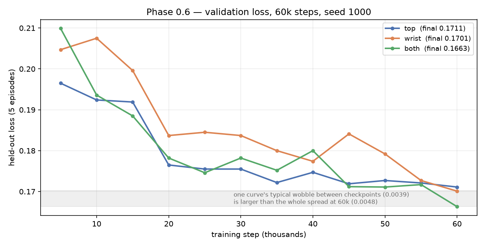
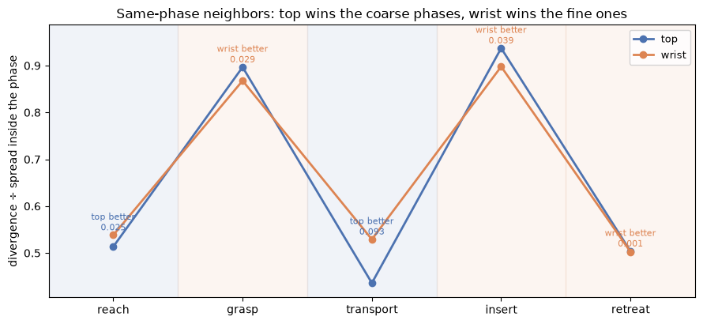
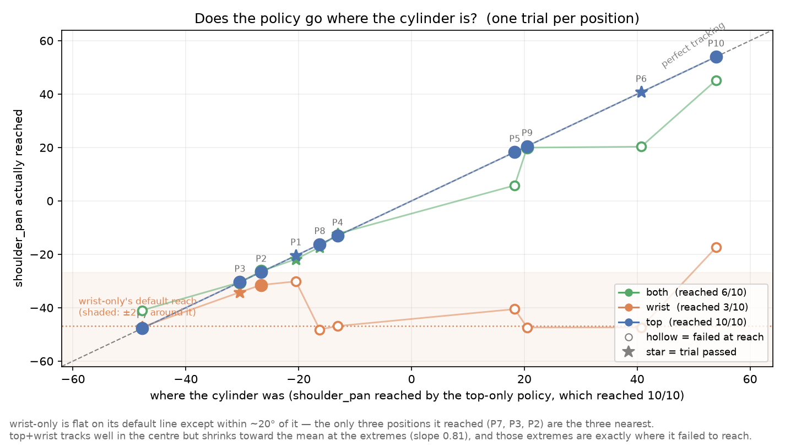

# Phase 0.6 — camera ablation: train ACT on top / wrist / top+wrist

Run book for the training-and-evaluation half of question **C1**. Phase 0.5 measured whether the second
camera *should* help ([phase05_camera_test_results.md](phase05_camera_test_results.md)); this phase
measures what actually changes in the policy's behavior when you take a camera away.

**Pass 1 (this doc's default): one seed, three conditions, behavior-focused.** Not a success-rate
measurement — too few trials for that. The goal is to see *how* a top-only and a wrist-only policy move
differently, and whether those differences match what the divergence metric predicted. Extend to multiple
seeds and a statistical success comparison only if pass 1 looks promising (§4b).

Plan: [08 §A.4](../08_data_quality_research.md) · Task: [toolkit_task_card.md](toolkit_task_card.md) ·
Dataset: `HALDijkstraaa/so101_toolkit_cylinder_20260917_165544` (50 episodes, 37,690 frames, 30 fps).
Scripts: [`scripts/train_camera_ablation.sh`](../scripts/train_camera_ablation.sh) ·
[`scripts/make_eval_schedule.py`](../scripts/make_eval_schedule.py). Written 2026-09-20.

---

# Summary

- **Train three policies. Do not train one and mask a camera at inference** — in lerobot's ACT each camera
  contributes ~300 tokens to one encoder sequence, so removing a camera is an out-of-distribution input,
  not an ablation (§1).
- **60k steps, batch 8, checkpoints every 10k.** 100k is the ACT paper recipe, but for one simple task
  with 50 demos the 10k-spaced checkpoints tell you directly whether behavior was still changing at 60k
  (§2).
- **Run the three sequentially, not in parallel.** Measured: training is GPU-bound, so three concurrent
  processes each drop to ~1/3 speed and the set finishes **8% later** than back to back. VRAM was never
  the constraint (§5).
- **Total ~6.5 h at 60k steps** (top 1.6 h + wrist 1.6 h + top+wrist 3.1 h, plus ~12 min of validation
  passes) on the 5080 laptop, measured from the real trainer in fp32. No cloud GPU needed.
- **Tracked in wandb** (project `phase06-camera-ablation`, one run per condition so the curves overlay)
  and **pushed to the Hub as private repos** at the end of each run.
- **Larger batches buy nothing.** Throughput is flat at ~59 samples/s from batch 8 to 32 — the GPU is
  saturated at batch 8 (§5).
- **The default holdout had to be fixed.** Episodes were recorded position-block by position-block
  (P1 = ep 0–4 … P10 = ep 45–49), so lerobot's "last 5 episodes" split would have put *all of P10* in
  validation and removed that position from training. The scripts now hold out a balanced set (§2).
- **Nice property of lerobot's ACT: the ResNet18 backbone is shared across cameras**, so all three
  conditions have essentially the same parameter count. No capacity confound.

| Step | What | Time | Attended? |
|---|---|---|---|
| 0 | Preflight checks | 5 min | yes |
| 1 | Smoke test, 500 steps × 3 | ~5 min | yes |
| 2 | Three training runs, 60k steps, sequential | ~6.5 h | no |
| 3 | Checkpoint selection | 10 min | yes |
| 4 | Behavior pass: 30 rollouts, video recorded | ~45 min | yes |
| 5 | Watch the video, write up behavioral differences | ~1 h | yes |

---

# 1 — Why three policies, and not one with a masked camera

The tempting shortcut is to train `top+wrist` once and zero or drop a camera at inference. It does not
measure what we want. From `policies/act/modeling_act.py` (line ~475 in 0.6.1):

```python
for img in batch[OBS_IMAGES]:
    cam_features = self.backbone(img)["feature_map"]
    cam_pos_embed = self.encoder_cam_feat_pos_embed(cam_features)
    ...
    encoder_in_tokens.extend(list(cam_features))
```

Each 480×640 image goes through ResNet18 (stride 32) to a 15×20 feature map = **300 tokens per camera**,
appended into one transformer encoder sequence alongside the latent and robot-state tokens.

| Shortcut | What actually happens |
|---|---|
| **Drop a camera** | Sequence length changes 602 → 302. The encoder never saw that length; the learned relationship between the state/latent tokens and the image block is gone. |
| **Zero the image** | Length is preserved, but a black frame is an input the model never saw. |

Either way you measure *graceful degradation under camera failure*, which is a robustness question, and
the error is biased against whichever camera the joint policy leaned on more — exactly the quantity under
test. Three separate trainings, three separate policies.

**Two architecture details worth knowing before reading the results:**

- **One shared backbone for all cameras.** Unlike the original ACT (a separate ResNet per camera), lerobot
  reuses `self.backbone` in the loop. So `top`, `wrist` and `top+wrist` have nearly identical parameter
  counts — measured 51.6M for the two-camera config. The only thing that differs between conditions is
  what the encoder sees, which makes this ablation cleaner than it would be upstream.
- **No camera-identity embedding.** `encoder_cam_feat_pos_embed` is a 2D sinusoidal embedding computed
  from the feature map's H×W, so **both cameras receive identical positional embeddings**. ACT tells the
  two views apart purely by appearance, not by any positional tag. (Relates to the temporal-encoding
  discussion in [phase05 results](phase05_camera_test_results.md) "Future studies".)

---

# 2 — Training recipe, and the two places the defaults are wrong

Everything except the camera set is held fixed. **Do not tune per condition** — a per-condition tune
invalidates the comparison.

| Knob | Value | Why |
|---|---|---|
| Policy | ACT, `resnet18`, `chunk_size=100`, `n_action_steps=100` | 0.6.1 defaults = the paper recipe |
| Batch / lr | 8 / 1e-5 | Original ACT recipe, and batch 8 already saturates the GPU (§5) |
| **Steps** | **60,000** (`save_freq=10000`) | See below |
| Seed | 1000, same for all three | One seed this pass; removes init/shuffle noise from the comparison |
| Dataset | `..._165544`, 50 episodes | The `_163836` (5 ep) and `_164823` (3 ep) folders are test runs — do not use |
| **Holdout** | **episodes 9, 19, 29, 39, 49** | See below |
| Normalization | Dataset stats, `use_imagenet_stats=true` | Default; identical inputs across runs |

### Why 60k and not 100k

100k × batch 8 = 800k samples ≈ **21 passes** over 37,690 frames. That is the ACT paper's recipe, sized
for harder bimanual tasks. This is one simple task with a fixed fixture and a single grasp style, so 100k
is likely past the point where behavior stops changing — but "likely" is not measured, and an undertrained
policy would look like a camera effect.

So: **60k steps with a checkpoint every 10k**, and let the checkpoints answer the question. Compare the
40k and 60k checkpoints on the robot. If they behave the same, you converged and 60k was enough. If they
differ, resume:

```bash
lerobot-train --config_path=outputs/train/act_both_s1000/checkpoints/last/pretrained_model/train_config.json --resume=true --steps=100000
```

Cost of the choice: 60k is ~6.3 h for all three, 100k is ~10.5 h. Both are one unattended session, so if
you would rather not think about it, run `STEPS=100000` and skip the question.

Disk: each ACT checkpoint is ~620 MB (51.6M params plus Adam state), so 6 checkpoints × 3 runs ≈ **11 GB**.

### Why the holdout had to be changed

Episodes were recorded **one position at a time**, five in a row before the cylinder moved:

```
ep 0-4 = P1 · 5-9 = P2 · 10-14 = P3 · … · 45-49 = P10
```

`datasets/factory.py` holds out *the last* `ceil(n × eval_split)` episodes of the episode list. With the
default ordering that is episodes 45–49 — **all five repetitions of P10**. Two things go wrong:

1. **P10 disappears from training.** All three policies would be evaluated at a tape mark they had never
   seen, at one of the ten positions you plan to test.
2. The validation loss would measure out-of-position generalization from a single position, not fit.

The fix uses the fact that the split slices the tail of `--dataset.episodes` **in the order given**
(verified: `LeRobotDataset` preserves the order, and the split takes the last `n_eval` of it). The scripts
pass the 45 training episodes first and a balanced holdout last:

```
holdout = 9, 19, 29, 39, 49      # the last episode of P2, P4, P6, P8, P10
```

Every position keeps at least 4 episodes in training. Verified end to end: 45 train / 5 eval, eval
episodes exactly `[9, 19, 29, 39, 49]`, and P10 retains episodes 45–48 in training.

**`eval_steps` must be set too.** lerobot defaults to `eval_steps=0`, which builds the eval dataloader and
then never runs it (`is_eval_step = cfg.eval_steps > 0 and ...`) — the holdout episodes would be dropped
from training and produce nothing in return. The script passes **`--eval_steps=5000`**: measured at ~30 s
per pass over the full 5-episode holdout with two cameras (~15 s with one), that is 12 points on the wandb
curve for ~12 min across the three runs.

> **Do not set `--max_eval_samples`.** It looks like a way to make validation cheaper, but it slices
> `frames[:per_task]` — the **first** n frames of the holdout, not a sample of it. With one task that means
> the opening of episode 9 and nothing else: you would be validating on the reach phase of a single
> position. Leave it at 0 and use the whole holdout.

To skip validation entirely and train on all 50, pass `EVAL_SPLIT=0` (the script then also forces
`eval_steps=0`, since `eval_steps > 0` with `eval_split == 0` raises). The validation loss is a sanity
check for divergence only — action-prediction L1 correlates weakly with task behavior, and it cannot
settle this ablation either way.

> **Knock-on caveat for Phase 0.5.** Position-block recording means **position is confounded with session
> time**: anything that drifted over the recording session (lighting, operator fatigue) varies with
> position index. Phase 0.5's conclusions are unaffected — it bootstrapped over episodes and never broke
> results down by position — but any future per-position analysis of this dataset carries the confound.

### Decisions taken (2026-09-20)

Recorded so the write-up does not have to reconstruct them.

| Decision | Choice | Reasoning |
|---|---|---|
| **Action chunking at rollout** | ~~`n_action_steps=25`~~ → **the stored 100** (reverted 2026-09-21, see §4a "Why 25 stalls") | The default 100 is 3.3 s of blind motion at 30 fps — the policy would consult the cameras only ~9 times in a 30 s episode, throttling the very effect under test. 25 gives ~36 observations per episode. Set at rollout, no retraining. Temporal ensembling (`n_action_steps=1`) was rejected: it needs a policy call every frame, and the two-camera forward pass is estimated at ~45 ms (~22 Hz), which would give the three conditions *different* effective control rates |
| **Precision** | **fp32** (`use_amp=false`, the default) | The reference ACT recipe. bf16 AMP is ~1.3× faster (~5.2 h) but nothing has verified ACT converges identically under it here, and a numerics surprise would be indistinguishable from a camera effect |
| **Image augmentation** | **Off** (the default) | Color and affine jitter would not affect the two views equally — the wrist view is dominated by gripper and cylinder, the top view by a static scene — so it could shift the camera ranking for reasons unrelated to observability |
| **Hub push** | **Final model of each run**, private, **as a separate step after training** | All 6 checkpoints per run stay on local disk (~11 GB), which is where the 40k-vs-60k convergence check needs them. Pushing from inside `lerobot-train` is what killed the first attempt (§7) |
| **Validation** | Every 5000 steps, full holdout | 12 points on the curve for ~12 min total |
| **Logging** | wandb, `log_freq=200` | Three runs in one project so the curves overlay |

---

# 3 — Training, step by step

### Step 0 — preflight

```bash
conda activate lerobot && nvidia-smi --query-gpu=name,memory.used,memory.total --format=csv && du -sh ~/.cache/huggingface/lerobot/HALDijkstraaa/so101_toolkit_cylinder_20260917_165544 && df -h /home | tail -1
```

Checks: the env is active, the GPU is idle (close anything holding VRAM), the dataset is cached locally,
and there is disk room for ~11 GB of checkpoints.

### Step 1 — smoke test

Five minutes now beats discovering a typo after an overnight run. This runs 500 steps of each condition:

```bash
STEPS=500 SAVE_FREQ=500 EVAL_STEPS=250 OUT=outputs/smoke ./scripts/train_camera_ablation.sh
```

Check in the log that each run prints `Train/eval split: 45 train, 5 eval` and the right input features
(`observation.images.top` only, `observation.images.wrist` only, then both), and that loss is falling.
`num_learnable_params` should read **51,597,190 for all three** — the shared-backbone property from §1,
confirmed empirically. Then delete `outputs/smoke`.

Verified 2026-09-20: all three split 45/5, correct features, loss 6.89 → 2.97 over 500 steps, identical
parameter counts, 591 MB per checkpoint.

The smoke run also exercises wandb. It does **not** push to the Hub: the script refuses to push when
`STEPS < 10000`, so a forgotten `PUSH_TO_HUB` cannot litter your HF account with 500-step models.

### Step 2 — the three runs

```bash
./scripts/train_camera_ablation.sh
```

Runs `top`, `wrist`, `both` **sequentially** at 60k steps each, ~6.5 h total, logging to
`outputs/train/act_<cond>_s1000.log` and streaming to wandb. Useful variants:

```bash
STEPS=100000 ./scripts/train_camera_ablation.sh
```

```bash
EVAL_SPLIT=0 ./scripts/train_camera_ablation.sh
```

```bash
SEED=1001 ./scripts/train_camera_ablation.sh wrist
```

```bash
WANDB=false ./scripts/train_camera_ablation.sh
```

### Step 2b — push the models

Separate from training on purpose (§7):

```bash
./scripts/push_models.sh
```

Uploads each finished `checkpoints/last/pretrained_model` (198 MB) to a private
`HALDijkstraaa/act_toolkit_cylinder_<cond>_s1000`. `CKPT=040000 ./scripts/push_models.sh` pushes a
specific checkpoint instead; naming a condition (`./scripts/push_models.sh top`) pushes just that one.

The script rewrites any `socks://` proxy variable to `http://` before uploading — see §7.

The script is a thin wrapper; the single command it issues for the top-only condition is:

```bash
lerobot-train --dataset.repo_id=HALDijkstraaa/so101_toolkit_cylinder_20260917_165544 --dataset.episodes="[0, 1, 2, 3, 4, 5, 6, 7, 8, 10, 11, 12, 13, 14, 15, 16, 17, 18, 20, 21, 22, 23, 24, 25, 26, 27, 28, 30, 31, 32, 33, 34, 35, 36, 37, 38, 40, 41, 42, 43, 44, 45, 46, 47, 48, 9, 19, 29, 39, 49]" --dataset.eval_split=0.1 --eval_steps=5000 --policy.type=act --policy.device=cuda --policy.push_to_hub=false --policy.input_features="{'observation.state': {'type': 'STATE', 'shape': [6]}, 'observation.images.top': {'type': 'VISUAL', 'shape': [3, 480, 640]}}" --batch_size=8 --steps=60000 --num_workers=8 --seed=1000 --save_freq=10000 --log_freq=200 --output_dir=outputs/train/act_top_s1000 --job_name=act_top_s1000 --wandb.enable=true --wandb.project=phase06-camera-ablation
```

The `wrist` condition swaps the image key; the `both` condition **omits `--policy.input_features`
entirely**, since both cameras is the default.

> **How the camera selection works.** `policies/factory.py` fills `cfg.input_features` from the dataset
> only `if not cfg.input_features`, so a CLI override survives. There is no flag for "use a subset of
> cameras" — this is the mechanism.

### Step 3 — monitor and select

Watch it in wandb — all three runs land in project `phase06-camera-ablation`, named `act_top_s1000`,
`act_wrist_s1000`, `act_both_s1000`, so `train/loss` and `eval_loss` overlay on one chart. Or locally:

```bash
tail -f outputs/train/act_both_s1000.log
```

Expect ~10.6 it/s for the single-camera runs and ~5.4 it/s for `both`, with a smoothly falling L1 loss.
Take the **final checkpoint** of each run for the behavior pass, and keep the 40k one for the
convergence check in §2:

```
outputs/train/act_top_s1000/checkpoints/last/pretrained_model
```

---

# 3.5 — Training record (2026-09-21)

All three runs finished at 60k steps, seed 1000, fp32, no augmentation.
**wandb:** [phase06-camera-ablation](https://wandb.ai/bj-huang-university-of-toronto/phase06-camera-ablation?nw=nwuserbjhuang)



*Held-out loss on the 5 balanced episodes, every 5000 steps, plotted from the run logs. The shaded band
marks how much a single curve moves between neighbouring checkpoints.*

| Run | final `eval_loss` | wall clock | Hub (private) |
|---|---|---|---|
| `act_top_s1000` | 0.1711 | 1 h 39 m | `HALDijkstraaa/act_toolkit_cylinder_top_s1000` |
| `act_wrist_s1000` | 0.1701 | ~1 h 40 m | `…_wrist_s1000` |
| `act_both_s1000` | **0.1663** | ~3 h 15 m | `…_both_s1000` |

**Reading it honestly:**

- **The final ranking is `both` < `wrist` < `top`**, the direction Phase 0.5 predicted (P1), and the
  `both`-over-`wrist` margin is small (P2). So far so consistent.
- **But the ranking is not resolved by this metric.** The whole spread at 60k is **0.0048**, while a single
  curve's typical move between neighbouring checkpoints is **0.0039**. The curves also cross repeatedly:
  `wrist` is the worst space for most of training and only overtakes `top` in the last two checkpoints.
  One seed, one holdout of 5 episodes. Treat the ordering as *not contradicting* Phase 0.5, not as
  confirming it.
- **Nothing had converged at 60k.** All three are still trending down, and `both` takes its largest single
  drop at the very last checkpoint (0.1717 → 0.1663). 60k was a budget, not a plateau. Which is exactly
  why the 40k checkpoints are worth keeping: if the 40k and 60k policies behave the same on the robot,
  the budget was enough; if they differ, the comparison needs more steps before it means anything.
- This is also the reason the real answer has to come from rollouts. A 0.005 difference in action-
  prediction L1 says almost nothing about whether the arm finds the cylinder.

---

# 4 — Evaluation

## 4a — Pass 1: the behavior pass (this phase)

30 rollouts — 10 per policy, one per position — in about an hour. **This is not a success-rate
measurement**: 10 trials per condition gives a ±16-point standard error, so anything under ~30 points is
noise. What it gives you is video of three policies attempting the same ten positions, which is enough to
see *behavioral* differences long before they are statistically significant.

Evaluate the **60k checkpoints** of all three (lowest held-out loss for each, and the same step for all
three, so no condition gets a cherry-picked checkpoint).

### Step 1 — generate the schedule (already done)

```bash
python scripts/make_eval_schedule.py --seed 0 > Details/phase06_eval_log.csv
```

`lerobot-rollout` records N episodes of one policy in a row, so a fully interleaved trial order would mean
restarting the process 30 times. The schedule splits the positions in half and runs every condition once
per half, so each policy gets the same positions at the same point in the session:

```
half A = P2 P4 P6 P8 P9        half B = P1 P3 P5 P7 P10
  block 1: both  (A) -> P6  P2  P8  P4  P9
  block 2: top   (A) -> P4  P9  P8  P6  P2
  block 3: wrist (A) -> P4  P8  P9  P2  P6
  block 4: top   (B) -> P3  P1  P10 P7  P5
  block 5: wrist (B) -> P10 P1  P3  P7  P5
  block 6: both  (B) -> P1  P5  P3  P7  P10
```

Six `lerobot-rollout` invocations, five episodes each.

### Step 2 — set up the rig

1. **Plug in the follower only** (`/dev/ttyACM0`). The leader is not needed: with no teleop connected, the
   episodic strategy returns the arm to the joint positions captured at startup between episodes.
2. **Put the arm in the home pose before you start** — that startup pose becomes the reset pose for the
   whole block.
3. **Load the camera presets**: Cameractrls, preset 1 for the C920 (top), preset 2 for the C922 (wrist).
   The policies were trained on images those presets produce; an unloaded preset is a distribution shift
   that will look like a policy failure. [01 Step 6](../01_setup_robot.md).
4. **Check the fixture** is on its taped outline and the P1–P10 marks are where they were during recording.
5. Place the cylinder on **block 1's first position (P6)** before running anything.

### Step 3 — run one block

Set `COND` and `HALF` from the schedule, then run. This is block 1 (`both`, half A):

> **The assignments must be separated by `&&` (or `;`), not spaces.** Written as a command *prefix*
> (`COND=both HALF=a lerobot-rollout … act_${COND}_s1000 …`) the shell expands `${COND}` on that same
> line *before* applying the assignment, so the path silently becomes `act__s1000`, the camera paths
> become empty, and `from_pretrained` falls through to the Hub with a garbage repo id:
> `HFValidationError: Repo id must be in the form 'repo_name' or 'namespace/repo_name'`.

```bash
cd /home/bj/Documents/bingjian/robot_learning/smolvla_so101 && COND=both && HALF=a && TOP=/dev/v4l/by-id/usb-046d_HD_Pro_Webcam_C920_A8C83F4F-video-index0 && WRIST=/dev/v4l/by-id/usb-046d_C922_Pro_Stream_Webcam_5B3ADD8F-video-index0 && lerobot-rollout --strategy.type=episodic --policy.path=outputs/train/act_${COND}_s1000/checkpoints/last/pretrained_model --robot.type=so101_follower --robot.port=/dev/ttyACM0 --robot.id=my_follower --robot.cameras="{ top: {type: opencv, index_or_path: $TOP, width: 640, height: 480, fps: 30, fourcc: MJPG}, wrist: {type: opencv, index_or_path: $WRIST, width: 640, height: 480, fps: 30, fourcc: MJPG} }" --dataset.repo_id=HALDijkstraaa/rollout_phase06_eval_${COND}_${HALF} --dataset.no_stamp=true --dataset.single_task="Pick up the white cylinder and place it in the hole of the black fixture" --dataset.num_episodes=5 --dataset.episode_time_s=60 --dataset.reset_time_s=10 --dataset.fps=30 --dataset.push_to_hub=false --display_data=true
```

Then repeat for blocks 2–6, changing only `COND` and `HALF`:

| Block | `COND` | `HALF` |
|---|---|---|
| 1 | `both` | `a` |
| 2 | `top` | `a` |
| 3 | `wrist` | `a` |
| 4 | `top` | `b` |
| 5 | `wrist` | `b` |
| 6 | `both` | `b` |

Verified to parse for both a single-camera and the two-camera policy: `act_top_s1000` loads with
`['observation.images.top', 'observation.state']` while `act_both_s1000` loads all three keys, and both
cameras attach in each case.

### Why `n_action_steps=25` stalls, and 100 does not

The planned 25-step chunk left the arm jittering at the home pose, unable to start until a hand moved in
front of the camera. The cause is in the training data, and it is measurable.

**Training episodes were never idle-trimmed.** Trimming was a change made in the *analysis* notebook
(§Phase 0.5), not in the dataset. So every episode begins with the arm parked at home while the operator
gets ready. Measuring the lead-in — frames until any joint moves more than 2 units, the same rule the
notebook used:

| idle lead-in before the arm first moves | frames (30 fps) |
|---|---|
| median / mean | **74 / 74** (≈ 2.5 s) |
| min / max | 34 / 141 |
| episodes with lead-in > 25 frames (0.83 s) | **50 / 50 — 100%** |
| episodes with lead-in > 50 frames (1.67 s) | 43 / 50 — 86% |
| episodes with lead-in > 100 frames (3.33 s) | 6 / 50 — 12% |

So from the home pose the policy's predicted chunk *begins with "stay still"* in every single episode it
learned from.

- **With `n_action_steps=25`** the robot executes 0.83 s — pure idle in 100% of the training distribution
  — then re-observes. The scene is unchanged: same home pose, same static table. So it predicts idle
  again. **A self-reinforcing stall**, broken only by changing the observation — which is exactly what
  waving a hand does.
- **With `n_action_steps=100`** the robot commits to 3.3 s open-loop, which clears the idle lead-in in 88%
  of the distribution and carries it into real motion before it ever re-observes.

This is the copycat / idle-attractor failure in miniature, and it is the same ambiguity Phase 0.5
measured: a single frame cannot distinguish "parked at home, about to start" from "parked at home,
waiting". Only temporal context can, and ACT has none.

**Consequences, stated plainly:**

- The §2 decision to use 25 was wrong for this dataset, and the reasoning behind it still stands — at
  `n_action_steps=100` the policy consults the cameras roughly nine times in a 30 s episode, which does
  throttle the effect under test. It is applied identically to all three conditions, so the comparison
  stays fair; it just measures the cameras' value at a coarse re-observation rate.
- **The real fix is in the data, not the rollout flag: trim idle frames before training.** That is a
  data-collection guideline worth carrying into Phase 0.5's results doc, and it would likely make shorter
  chunks viable — which would in turn make this ablation more sensitive.

**Why each flag is what it is:**

- **No `n_action_steps` override — the stored 100 is used.** The planned 25 was tried first and *failed*:
  the arm jittered in place at the home pose and would not start until a hand was waved in front of the
  camera. See "Why 25 stalls" below. All six blocks use the default.
- **Both cameras always connected**, even for the single-camera policies. The policy consumes only the
  keys in its own `input_features`; the extra stream is ignored, keeps the physical scene identical, and
  gives you both views on video for review. **Confirm on the very first block** that a single-camera
  policy does not error on the extra key — if it does, drop that camera from `--robot.cameras` for its
  blocks and note it.
- **`--dataset.no_stamp=true`** keeps the repo name predictable instead of appending a timestamp. The
  name check runs *before* stamping, so this does not interfere with it.
- **The dataset name must start with `rollout_`.** `build_rollout_context` rejects anything else outright
  (`Dataset names for rollout must start with 'rollout_'`). This is a **runtime** check, not a config
  check, so it fires only after the robot and cameras have already connected.
- **`episode_time_s=60`**, up from the planned 30. The 30 s success window still defines success, but a
  hard 30 s cutoff leaves no slack on a loaded CPU; press **→** when the outcome is clear.
- **`reset_time_s=10`** is your window to move the cylinder to the next scheduled position.
- **`--display_data=true`** gives you the live rerun view — use it to confirm image quality before the
  first episode commits.
- **The checkpoint path is a local directory, not a Hub id.** `PreTrainedConfig.from_pretrained` checks
  `Path(model_id).is_dir()` first and only falls back to `hf_hub_download` when that fails — so a path
  that expands wrong, or a missing directory, shows up as a confusing Hub validation error rather than
  "file not found".
- **Stale action queues are handled.** 06 flags `policy.reset()` on every restart as deployment hygiene;
  in 0.6.1 the episodic strategy calls `engine.reset()` between episodes, and the sync engine resets the
  policy, preprocessor and postprocessor. No leftover chunk carries into the next episode.

### Step 4 — during the session

- **→** ends the current episode or reset early · **←** discards and re-records · **Esc** stops the block.
- Use **←** only for a *rig* problem (cylinder knocked over during reset, wrong position placed). Do
  **not** re-record because the policy failed — the failures are the data.
- Between episodes, move the cylinder to the next position in that block's list.
- Jot `success` and `fail_stage` in `Details/phase06_eval_log.csv` as you go, or leave it and score from
  video afterwards. Either way, **`fail_stage` is the column that matters** — it is the direct test of the
  Phase 0.5 predictions in §6.

### Step 5 — after the session

Episodes land in `~/.cache/huggingface/lerobot/HALDijkstraaa/rollout_phase06_eval_<cond>_<half>/`. Score from
video, blind to condition if you can manage it, and fill in the log. Then write up per §6.

## 4b — Pass 2: the success-rate comparison (only if pass 1 looks promising)

Everything above is too small to compare success rates. When you want numbers:

| Decision | Value | Why |
|---|---|---|
| **Trials** | 3 per position × 10 positions × 3 policies = **90** (~2.5 h) | 30 per policy → ±9 points at 50%. At 20 trials it is ±11, enough to miss a real 15-point effect |
| **Seeds** | 3 per condition | With 50 episodes, seed variance is comparable to the effect size |
| **Ordering** | Interleaved blocks (`--trials-per-position 3`) | Blocked evaluation hands all session drift to whichever policy ran last |
| **Scoring** | From video, **blind to condition**, after the session | You will unconsciously favour the condition you expect to win |

Nine training runs (3 conditions × 3 seeds) is ~19 h sequentially here at 60k steps — two nights, or a
couple of hours on rented GPUs in parallel.

---

# 5 — Compute: measured on this machine

RTX 5080 Laptop (16 GB), driver 595.84, torch 2.11+cu130, 24 CPU cores. Two sets of numbers below:
**as-run** figures come from the real trainer in fp32 (lerobot's `use_amp` default), **bench** figures
come from an isolated harness under bf16 autocast, which is ~1.3× optimistic. Trust the as-run column for
planning; the bench rows are for the batch-size, worker and parallelism *comparisons*, where the ratio is
what matters and the precision is held constant.

### As run — plan from these

Measured from the smoke run, 2026-09-20, steady-state rate (the first ~200 steps are slower while the
dataloader fills):

| Condition | it/s | samples/s | VRAM | 60k steps | 100k steps |
|---|---|---|---|---|---|
| `top` | 10.6 | 85 | 2.1 GiB | **1.6 h** | 2.6 h |
| `wrist` | 10.4 | 84 | 2.1 GiB | **1.6 h** | 2.7 h |
| `top+wrist` | 5.4 | 43 | 3.7 GiB | **3.1 h** | 5.2 h |
| **Total, sequential** | | | | **~6.3 h** | **~10.5 h** |

Add a few minutes for periodic validation on the 5 held-out episodes every 5000 steps.

**`--policy.use_amp=true` is ~1.3× faster** (it drives Accelerate's `mixed_precision` to bf16), which
would bring the set to ~4.6 h. It is **not** enabled by default here: it changes the numerics of the
reference recipe, and nothing has verified ACT converges identically under it on this data. If you turn it
on, turn it on for all three conditions.

### Bench — batch size and workers (bf16 harness)

| Cameras | Batch | Workers | ms/step | **samples/s** | Peak VRAM |
|---|---|---|---|---|---|
| one (`top`) | 8 | 8 | 72 | **111** | 2.0 GiB |
| one (`top`) | 8 | 16 | 72 | 111 | 2.0 GiB |
| two | 8 | 8 | 134 | **60** | 3.5 GiB |
| two | 8 | 16 | 134 | 60 | 3.5 GiB |
| two | 16 | 8 | 269 | 59 | 6.3 GiB |
| two | 32 | 8 | 549 | 58 | 11.9 GiB |

**Two findings:**

1. **Larger batches buy nothing.** Throughput is flat at 58–60 samples/s across batch 8, 16 and 32 —
   step time scales exactly linearly with batch size. The GPU is already saturated at batch 8. Bigger
   batches only cost VRAM (11.9 of 16 GiB at batch 32) and change the optimization recipe. **Stay at 8.**
2. **The bottleneck is the GPU, not video decoding.** Doubling workers from 8 to 16 changes nothing, and
   a single-camera run is almost exactly **twice** as fast — which is the cost of one ResNet18 pass and
   300 tokens, not of decoding. Both videos are decoded either way (`LeRobotDataset` has no column
   selection), so if decoding were the limit the single-camera run would not have sped up.
   *This corrects an earlier note in this doc that said all three runs would cost the same wall clock.*

### Can the three run in parallel on 16 GB? Measured: yes, but don't

Three concurrent processes, batch 8, 6 workers each (bf16 harness, so compare the two rows to each other,
not to the as-run table):

| | ms/step each | samples/s each | 60k steps |
|---|---|---|---|
| Three in parallel | 295 / 295 / 299 | 27 | **5.0 h** (all finish together) |
| Sequential, back to back | 72 / 72 / 134 | 111 / 111 / 60 | **4.6 h** |

(Both rows exclude validation passes, which add ~12 min across the three runs at `eval_steps=5000`.)

- **Memory is not the problem**: the three allocator peaks sum to 7.5 GiB of 16 GiB.
- **Speed is.** Each process drops to roughly a third of its solo speed — the exact signature of three
  jobs time-slicing one saturated GPU — and the set finishes **8% later** than running them back to back,
  with the context-switching overhead as the loss. Note also that in parallel all three run at the *same*
  295 ms/step even though `both` does twice the work of `top`: the scheduler is dividing the GPU evenly,
  not doing more work.
- **Verdict: run them sequentially**, which is what the script does. Parallelism only pays on separate
  GPUs.

This supersedes the "ACT · ~5 GB @ bs 8 · train on cloud 4090" row in
[08 §D.1](../08_data_quality_research.md) for the small real-track datasets: measured, ACT trains
comfortably on the 5080, and the only reason to rent a GPU is running seeds concurrently.

---

# 6 — What to look for, and what Phase 0.5 predicts

The behavior pass produces video, not a p-value. Phase 0.5 found that, once divergence is normalized
within each phase, each camera wins exactly where its geometry says it should:



*Phase 0.5: top is better by 0.025 in reach and 0.093 in transport; wrist by 0.029 in grasp and 0.039 in
insert.*

**Pre-registered predictions** — write these down before watching the video, so the read isn't
retro-fitted:

| # | Prediction | Behavioral signature to look for | From |
|---|---|---|---|
| **P1** | `top+wrist` is the most competent overall | Fewest stalls, fewest retries | H-c: lowest divergence overall |
| **P2** | The `top+wrist` advantage over `wrist` alone is **small** | Hard to tell apart by eye | The two views are largely redundant: 0.499 vs 0.522 at k=10 |
| **P3** | `wrist`-only fails at **reach** | Arm sets off in a generic direction, or toward an average position, regardless of where the cylinder is. Should be worst at the extreme positions | H-b: top wins reach/transport |
| **P4** | `top`-only fails at **grasp/insert** | Reaches the right area confidently, then closes the gripper a few mm off, or hovers over the hole without seating | H-a: wrist wins grasp/insert |
| **P5** | All three struggle in grasp and insert | High retry/hover rate everywhere | In the fine phases *no* observation space beat the random baseline |

**Also worth watching for, because the metric cannot predict it:**

- **Does `wrist`-only exhibit search behavior?** Sweeping until the cylinder enters view would be the
  interesting positive result — a policy compensating for a missing view with motion.
- **Smoothness.** Higher action divergence in training data tends to show up as jitter or hesitation at
  the ambiguous moments, not only as failure.
- **Where each policy commits.** The moment a trajectory stops being generic and starts aiming at the
  actual cylinder position is a direct read on when the observation became informative.

**Write up:** for each condition, the failure-stage tally over the 10 trials, one or two representative
video clips, and a paragraph on the above. That, plus the held-out L1, is the first data point for Future
Study #1 in the [Phase 0.5 results](phase05_camera_test_results.md): does divergence predict performance?

---

# 6.5 — Results: all 30 trials (2026-09-21)

Six blocks, 10 trials per condition, every position once per condition.
Log: [phase06_eval_log.csv](phase06_eval_log.csv).

| Condition | Passed | **Reached the cylinder** | reach fails | grasp fails | insert fails |
|---|---|---|---|---|---|
| `top` only | 2/10 | **10/10** | **0** | 4 | 4 |
| `top + wrist` | 3/10 | 6/10 | 4 | 2 | 1 |
| `wrist` only | 2/10 | 3/10 | **7** | 1 | 0 |

**Success rate settles nothing — 3/10 vs 2/10 vs 2/10 is noise at ±15 points.** Everything below comes
from *where* the policies failed, which at the same sample size is far more informative. That is itself a
methodological result: **with few trials, score sub-goal attainment, not binary success.**

## 1. The two cameras fail in opposite phases — confirmed

- **`top`-only reached the cylinder in 10/10 trials and never once failed at reach.** All 8 of its failures
  are in the fine phases (4 grasp, 4 insert), and the split replicated exactly across halves: 0/2/2 in
  half A, 0/2/2 in half B. Operator note on P9: *"top cam can't find the exact spot for insertion."*
- **`wrist`-only failed at reach in 7 of 10**, and never reached an insertion at all.
- Failure-stage distribution, `top` (0/8 at reach) vs `wrist` (7/8): **Fisher exact p = 0.0014**.
  On the cleaner per-trial framing, reached-the-cylinder 10/10 vs 3/10: **p = 0.0031**.

**P3 and P4 confirmed, in opposite directions.** This is the double dissociation the experiment was
designed to find, and it is significant despite ten trials per condition.

## 2. Wrist-only has a capture range — and it explains every one of its outcomes



*`shoulder_pan` at the grasp attempt (first gripper closure after the gripper opens — it starts closed at
home) against where the cylinder actually was. The x-axis uses the top-only policy's own reach as the
position reference, which is fair because it reached 10/10, but means `top` lies on the identity line by
construction and cannot be judged by it.*

`wrist`-only sits flat on one default line at **−46.9°** regardless of the cylinder — the average-reach
behavior you saw. But it is not uniformly blind:

| | positions | wrist reached? |
|---|---|---|
| within ~20° of its default | P7 (0.9°), P3 (16.4°), P2 (20.2°) | **3/3** |
| beyond | P1, P8, P4, P5, P9, P6, P10 (26–101°) | **0/7** |

**The three positions `wrist` reached are exactly the three nearest its default trajectory.** Under random
assignment that ordering has probability 1/C(10,3) = **0.008**. Your reading is right, and sharper than
"sometimes it works": the policy commits to a fixed opening move, and *if that move happens to sweep the
cylinder into the wrist's field of view, it can then servo onto it* — P3 at −30.4° pulled the arm from
−46.9 to −34.2, real visual adaptation. Outside that capture band the cylinder never enters frame, so
there is nothing to adapt to.

This also explains its one non-reach failure: **P2 is the third-nearest position**, the arm got there, and
it failed at grasp instead.

## 3. Adding the wrist camera made reaching *worse* — the compounding effect, located

`top+wrist` reached 6/10 where `top` alone reached 10/10 (Fisher p = 0.087 — suggestive, not significant
at this n). Your "compounding effect" reading holds up, and the data says exactly where it bites.

Regressing `both`'s reach against `top`'s over the same ten positions gives a **slope of 0.81**: `both`
under-shoots the extremes by 17% on average. Position by position:

| | centre (P3 P2 P1 P8 P4 P9) | extremes (P7 P5 P6 P10) |
|---|---|---|
| `both` vs `top` reach | within ~1.5° — indistinguishable | −47.7→−41.0, +18.3→+5.8, +40.7→+20.3, +54.0→+45.2 |
| `both` reach failures | 0 | **4 of 4** |

**`both` is a partial version of `wrist`'s collapse**: fine in the middle of the workspace, dragged toward
the mean at the edges — and every one of its reach failures is at an edge. The wrist stream carries no
position information during reach but supplies half the visual tokens, and the further the cylinder is
from the wrist's default view, the more that uninformative half pulls.

**On "does it need more training steps?"** — worth testing, but the evidence cuts both ways:

- *For:* validation loss was still falling for all three at 60k, `both` took its steepest drop at the very
  last checkpoint, and `both` processes 600 image tokens against 300, so it plausibly needs longer.
- *Against:* `both` already had the **lowest** validation loss of the three. If it were the least-trained
  model you would expect the opposite. The deficit is in *arbitration* — knowing which camera to trust in
  which phase — and held-out action L1 does not measure that.

A second candidate cause is architectural, and specific: **ACT gives the model no camera-identity signal.**
`encoder_cam_feat_pos_embed` is a 2D sinusoidal embedding of the feature map's H×W, so both cameras'
300-token blocks receive *identical* positional embeddings (§1). The network must infer which camera a
token came from purely from appearance, and then learn phase-dependent trust, from 45 demonstrations.

Two clean follow-ups, in order of cost:

1. **Resume `both` to 120k** and re-run only the four extreme positions (P7 P5 P6 P10), 2 trials each — 8
   trials, ~30 min of robot time. Direct test of the training-budget hypothesis.
2. **Add a learned per-camera embedding** to ACT's encoder input and retrain `both`. Small change,
   directly targets arbitration, and it is a publishable negative-or-positive either way.

## 4. What this says about the divergence metric

This was Future Study #1 in the [Phase 0.5 results](phase05_camera_test_results.md): does divergence
predict policy performance? Partially, and the failure is as informative as the success.

| Phase 0.5 said | The robot said |
|---|---|
| Top wins reach/transport; wrist wins grasp/insert (H-a, H-b) | **Confirmed** — a significant double dissociation |
| Wrist frames cannot tell the ten positions apart during reach | **Confirmed**, with a measured capture range around a fixed default |
| Grasp and insert sit near the random baseline for every space | **Consistent** — 8 of `top`'s 10 trials died there, and `both` never exceeded 3/10 |
| top+wrist has the lowest divergence, so it should be best (H-c) | **Not supported.** Best success rate, but worse at reaching than `top` alone |

**The gap worth carrying forward: divergence measures what information is *available* in an observation
space, not whether a network can exploit it without harm.** Phase 0.5 already found the two views largely
redundant (0.499 vs 0.522); it had no way to predict that the redundant stream would actively degrade the
phase the other camera was carrying. A metric of availability needs a companion notion of *fusability*.

## Caveats

- **One trial per position per condition, 10 per condition.** Every per-position statement is n = 1.
- The position reference is `top`'s own reach, valid as a reference because it reached 10/10, but it makes
  `top` exact by construction.
- The ±20° capture band was chosen after seeing the data; the rank statistic (1/120) is the honest test.
- **Block 6 (`both`, half B) ran last in the session**, so it carries the most drift. `both` ran *first*
  in half A, so across its ten trials the exposure partly cancels — but its half-B reach failures are the
  most drift-exposed result here.
- One seed, `n_action_steps=100` (~9 observations per episode), and a training set that was never
  idle-trimmed (§4a).

---

# 8 — Follow-ups

Ordered by cost. **F1 is the one the results actually demand**; the rest are optional.

| | Question it settles | Cost |
|---|---|---|
| **F1** | Is `top+wrist`'s reach deficit a training-budget problem? | 2.2 h unattended + 45 min robot |
| **F2** | Is it an arbitration problem ACT's architecture can't express? | ~4 h + 45 min robot |
| **F3** | Does idle-trimming let short action chunks work, sharpening every future ablation? | ~3.5 h + a retrain |
| **F4** | Firm up any number that ends up load-bearing | 1–2 days |
| **F5** | A companion metric for *fusability* | design work |

## F1 — Resume `both` to 100k and retest the extremes

Your hypothesis: `both` hasn't learned when to trust which camera, and the still-falling validation curve
says it is undertrained. §6.5 argues both sides; this settles it.

### Step 1 — resume training (~2.2 h, unattended)

```bash
cd /home/bj/Documents/bingjian/robot_learning/smolvla_so101 && ./scripts/resume_training.sh both 100000
```

40,000 more steps at ~5.3 it/s. Everything is read back from the checkpoint's `train_config.json`, so the
episode order, the 45/5 holdout, the seed, `save_freq` and `eval_steps` are preserved, and **the wandb
curve extends run `bj9f13g4` rather than starting a new one**. Only `--steps` is overridden.

Verified by dry-running the config through lerobot's own parser: `resume=True`, `steps=100000`,
`checkpoint_path=outputs/train/act_both_s1000/checkpoints/last`, `output_dir` unchanged, holdout tail
still `[9, 19, 29, 39, 49]`. The saved `training_step.json` reads `{"step": 60000}` and the loop is
`for _ in range(step, cfg.steps)`, so it is exactly 40k additional steps, not 100k fresh ones.

Afterwards: `./scripts/push_models.sh both`.

### Step 2 — retest, but **interleaved against the 60k checkpoint**

The tempting shortcut is to run the 100k policy on the four extreme positions and compare against
yesterday's numbers. **Don't** — that is a cross-session comparison, and session drift is exactly what the
block design was built to avoid ([06](../06_expand_data_multi_env.md) says the same: matched, interleaved
runs when comparing checkpoints). Run both checkpoints in one session:

- **Positions: P7, P5, P6, P10** — the four extremes, where `both` reached 0/4 and `top` reached 4/4.
- **2 trials per position per checkpoint = 16 trials**, ~45 min.
- **Four blocks, alternating**: 60k, 100k, 100k, 60k — so each checkpoint gets one early and one late block.

The 60k checkpoint is still on disk at `checkpoints/060000/pretrained_model`; `checkpoints/last` will point
at 100k after the resume. Same rollout command as §4a, changing only `--policy.path` and the dataset name:

```bash
cd /home/bj/Documents/bingjian/robot_learning/smolvla_so101 && STEP=060000 && TOP=/dev/v4l/by-id/usb-046d_HD_Pro_Webcam_C920_A8C83F4F-video-index0 && WRIST=/dev/v4l/by-id/usb-046d_C922_Pro_Stream_Webcam_5B3ADD8F-video-index0 && lerobot-rollout --strategy.type=episodic --policy.path=outputs/train/act_both_s1000/checkpoints/${STEP}/pretrained_model --robot.type=so101_follower --robot.port=/dev/ttyACM0 --robot.id=my_follower --robot.cameras="{ top: {type: opencv, index_or_path: $TOP, width: 640, height: 480, fps: 30, fourcc: MJPG}, wrist: {type: opencv, index_or_path: $WRIST, width: 640, height: 480, fps: 30, fourcc: MJPG} }" --dataset.repo_id=HALDijkstraaa/rollout_phase06_f1_both_${STEP} --dataset.no_stamp=true --dataset.single_task="Pick up the white cylinder and place it in the hole of the black fixture" --dataset.num_episodes=10 --dataset.episode_time_s=60 --dataset.reset_time_s=10 --dataset.fps=30 --dataset.push_to_hub=false --display_data=true
```

```bash
cd /home/bj/Documents/bingjian/robot_learning/smolvla_so101 && STEP=100000 && TOP=/dev/v4l/by-id/usb-046d_HD_Pro_Webcam_C920_A8C83F4F-video-index0 && WRIST=/dev/v4l/by-id/usb-046d_C922_Pro_Stream_Webcam_5B3ADD8F-video-index0 && lerobot-rollout --strategy.type=episodic --policy.path=outputs/train/act_both_s1000/checkpoints/${STEP}/pretrained_model --robot.type=so101_follower --robot.port=/dev/ttyACM0 --robot.id=my_follower --robot.cameras="{ top: {type: opencv, index_or_path: $TOP, width: 640, height: 480, fps: 30, fourcc: MJPG}, wrist: {type: opencv, index_or_path: $WRIST, width: 640, height: 480, fps: 30, fourcc: MJPG} }" --dataset.repo_id=HALDijkstraaa/rollout_phase06_f1_both_${STEP} --dataset.no_stamp=true --dataset.single_task="Pick up the white cylinder and place it in the hole of the black fixture" --dataset.num_episodes=10 --dataset.episode_time_s=60 --dataset.reset_time_s=10 --dataset.fps=30 --dataset.push_to_hub=false --display_data=true
```

Use `STEP=100000` for the other two blocks. Because the same dataset name is reused for the second block
of a checkpoint, add `--resume=true` on that block, or give it a `_b` suffix.

### What the answer looks like

**Score "reached the cylinder", not success** — the deficit is in reach, and 8 trials cannot resolve a
success rate.

| Outcome | Reading |
|---|---|
| 100k reaches ≥ 6/8, 60k stays ≤ 2/8 | **Training budget.** Your hypothesis is right; the fusion just needed longer. Fisher p ≈ 0.007 at that split |
| Both around 0–2/8 | **Not the budget.** The deficit is arbitration — go to F2 |
| Both improve together | **Session effect**, not the checkpoint. This is exactly why the interleave is required |

Also re-measure the reach slope (§6.5, currently 0.81). Moving toward 1.0 is the mechanistic version of
the same answer and does not depend on the binary outcome.

## F2 — Give ACT a camera-identity embedding

`encoder_cam_feat_pos_embed` is a 2D sinusoidal embedding of the feature map's H×W, so **both cameras'
300-token blocks receive identical positional embeddings** (§1). The model has to infer which camera a
token came from purely from appearance, then learn phase-dependent trust, from 45 demonstrations.

The change is small: a learnable `nn.Embedding(n_cameras, dim_model)` added to each camera's block as it
is appended in `modeling_act.py`, **zero-initialised** so step 0 is exactly upstream ACT. Cost: 2 × 512 =
1024 parameters. Then retrain `both` at the same 60k and rerun the F1 retest.

Patch script: [`scripts/patch_act_camera_embed.py`](../scripts/patch_act_camera_embed.py) — idempotent,
asserts both anchors match exactly once. Verified locally: parameters land at 51,597,190 + 1,024, the
embedding starts at zero, and a forward pass runs.

This is worth doing even if F1 comes back positive — "more steps fixes it" and "the architecture makes it
unnecessarily hard" are both true-shaped answers, and the second is the more interesting one. It also
connects directly to the temporal-encoding discussion in the
[Phase 0.5 results](phase05_camera_test_results.md) "Future studies": in both cases ACT is asked to
separate token blocks that carry no positional tag distinguishing them.

## F3 — Retrain on idle-trimmed data

From §4a: the training set was never idle-trimmed, which forced `n_action_steps=100` and with it a coarse
~9 observations per 30 s episode. Trimming (the `dev > 2.0` rule the Phase 0.5 notebook uses) should make
short chunks viable, and a policy that re-observes every 0.8 s is a far more sensitive instrument for any
camera ablation — a camera can only matter at the moments the policy looks.

Retrain all three at 60k on the trimmed set, then rerun a reduced rollout pass with a short
`n_action_steps`. This is the follow-up that makes *future* ablations better rather than answering the
current one.

Trim script: [`scripts/make_trimmed_dataset.py`](../scripts/make_trimmed_dataset.py) — pass `--push` so
it uploads through `LeRobotDataset.push_to_hub()`. **A plain `hf upload` is not enough**: lerobot resolves
a dataset at the revision named by its `codebase_version`, so the repo needs a matching git tag, and only
`push_to_hub()` creates it. Without it the dataset downloads fine and then fails minutes into training
with "Your dataset must be tagged with a codebase version". Verified on the
3-episode test set: parquet rows equal decoded video frames for both cameras, and every trimmed episode
shows motion within its first 30 frames. ~13 frames/s, so **~40 min** for the 50-episode set — run it
locally and push, rather than burning a GPU session on CPU work.

## F4 — Firm up the load-bearing numbers

Only if something needs to survive review:

- The double dissociation is already significant (p = 0.0014) and replicated across halves — leave it.
- `top` 10/10 vs `both` 6/10 on reaching is **p = 0.087**. If that claim matters, 2 more seeds × 10 trials
  per condition would settle it; that is ~19 h of training plus a day of robot time.
- The ±20° capture band was chosen post-hoc. The rank statistic (1/120) does not depend on it, so this
  only needs fixing if the band itself becomes a claim.

## Running F2 and F3 on Colab

[`colab_phase06_f2_f3.ipynb`](../colab_phase06_f2_f3.ipynb), in four parts:

- **A — Setup.** Runtime check, lerobot v0.6.1 from source (F2 edits `modeling_act.py`, so a wheel will
  not do), HF and wandb auth, shared config.
- **B — Smoke test.** One cell, ~15 min. 300 real training steps against **both** datasets, then a
  readiness verdict and the projected runtime for the whole programme. Raises on any failure.
- **C — Training.** One cell. Runs F2 and F3 to completion, uploading as it goes. Refuses to start unless
  Part B passed.
- **D — Recovery.** Resume-from-Hub and single-run cells, if something fails.

**Use an L4** — compute-bound, peaks at 3.5 GiB, so an A100's 40 GB is wasted and a T4 is ~3× too slow.

Three things that make Part C safe to leave alone:

- **The patch is toggled, not applied once.** F2 edits `modeling_act.py` *on disk*, so it affects every
  later `lerobot-train` subprocess. `use_camera_embed(True/False)` restores from a pristine copy before
  each experiment, and every run asserts its parameter count — 51,597,190 stock, +1024 patched — so
  training the wrong variant fails immediately instead of producing a plausible-looking confounded
  result. Without this, the three F3 runs would silently have included the camera embedding.
- **Uploads happen throughout.** `save_checkpoint_to_hub` pushes at every 10k steps, tagged by step
  (recoverable with `--policy.pretrained_revision=<step>`), plus a final model push. A disconnect costs
  at most 10k steps.
- **Failures are recorded, not fatal.** The four runs are independent, so a transient Hub error on one
  does not cost the rest of the session; the closing summary says what succeeded.

**Authentication is the trap, not the training.** A Colab secret named `HF_TOKEN` is resolved *last* and
only via `google.colab.userdata.get()`, which needs the kernel's channel to the Colab frontend —
`lerobot-train` is a subprocess, so `whoami()` succeeds in the notebook while training authenticates as
nobody. Part A copies the token into `HF_TOKEN` and the token file, then proves a subprocess can use it.
It also asserts the token has global `repo.write`: a fine-grained token scoped to existing repos cannot
create the new model repos each run pushes to.

## F5 — A fusability companion to divergence

The conceptual gap from §6.5: divergence measures what information is *available* in an observation space,
not whether a network can exploit it without harm. Phase 0.5 scored top+wrist best; the robot found it
worse at reaching than top alone. Any candidate metric has to predict *that*, and nothing in the current
toolkit does. This is the most interesting open question the phase produced, and the least defined.

---

# 7 — Gotchas

| Risk | Mitigation |
|---|---|
| Camera presets not loaded before eval | Check the rerun view first ([01 Step 6](../01_setup_robot.md)). A dark top image is a distribution shift, and it will look like policy failure |
| Using the default episode ordering | Would remove P10 from training entirely (§2). The script handles it; check the log says `45 train, 5 eval` |
| Running the three in parallel to "save time" | Measured 8% slower (§5). Sequential |
| Raising the batch size to "use the VRAM" | Measured zero throughput gain (§5), and it changes the recipe |
| Fixture moved between training data and eval | Re-check the taped outline against the top view before starting |
| Single-camera policy errors on the extra camera key | Verify on the first rollout (§4a); fall back to dropping the camera from `--robot.cameras` |
| Reading 10 trials per condition as a success rate | It is ±16 points. Pass 1 is for behavior; §4b is for numbers |
| Overnight run dies silently | The script `tee`s logs; check `outputs/train/*.log` before starting eval |
| A failed run takes the rest down with it | It does — `set -euo pipefail` means `pipefail` propagates `lerobot-train`'s exit code through the `tee` pipe and `set -e` aborts the loop. That is correct for a genuine training failure, and it is why the Hub push was moved out of training |
| `socks://` proxy vs `huggingface_hub` | See below |
| `HFValidationError` on a local checkpoint path | The variables expanded empty. Separate the assignments with `&&`, not spaces — as a command prefix they apply to the process env *after* the line is expanded (§4a) |
| `Dataset names for rollout must start with 'rollout_'` | `lerobot-rollout` enforces the prefix in `build_rollout_context`. Use `--dataset.repo_id=<user>/rollout_<name>` |
| Arm jitters at home and never starts | `n_action_steps` too small for this dataset's idle lead-in — use the stored 100 (§4a) |
| An episode runs past 30 s | `episode_time_s=60` gives slack for a loaded CPU, but success is still **within 30 s** ([task card](toolkit_task_card.md)). `duration_s` is logged per trial — score anything that only succeeds after 30 s as a failure |
| Holding out episodes with `eval_steps=0` | lerobot's default never evaluates them — you lose 5 episodes for nothing (§2). The script sets `--eval_steps=5000` |
| Capping validation with `--max_eval_samples` | It takes the first n frames, not a sample: you would validate on the reach phase of one position (§2) |
| A smoke run pushed to the Hub | The script refuses to push when `STEPS < 10000` |

### The Hub-push failure of 2026-09-20

The `top` run finished cleanly at 60k (`eval_loss=0.1711`, 1 h 39 m), then died in `push_model_to_hub`:

```
ValueError: Unknown scheme for proxy URL URL('socks://127.0.0.1:7897/')
```

`huggingface_hub` 1.x uses **httpx**, which accepts `http://`, `https://` and `socks5://` proxies but
rejects a bare `socks://`. The VPN client exports `socks://127.0.0.1:7897`, so every Hub call through
httpx raises before sending anything. (`requests`, which wandb uses, tolerates it — which is why wandb
logged fine all the way through.)

Because the push runs *inside* `train()` and the script uses `set -euo pipefail`, the non-zero exit
propagated through the `tee` pipe and aborted the loop: **`wrist` and `both` never started.** Nothing was
lost from `top` — the final checkpoint was already on disk — but three hours of queued work evaporated.

**Two fixes, both applied:**

1. **Scheme rewrite.** `scripts/push_models.sh` rewrites any `socks://` proxy variable to `http://` on the
   same port before uploading. Clash's mixed port serves HTTP CONNECT as well as SOCKS5, so this needs no
   extra package. (The alternative, `pip install "httpx[socks]"` plus `socks5://`, also works.) For an
   interactive session:

   ```bash
   export ALL_PROXY=http://127.0.0.1:7897 all_proxy=http://127.0.0.1:7897
   ```

2. **Decoupling.** `PUSH_TO_HUB` now defaults to `false` in the training script. Training touches no
   network (the dataset is cached locally; only wandb needs it), so nothing that depends on the network
   should be able to end a training queue. Push afterwards with `./scripts/push_models.sh`.
